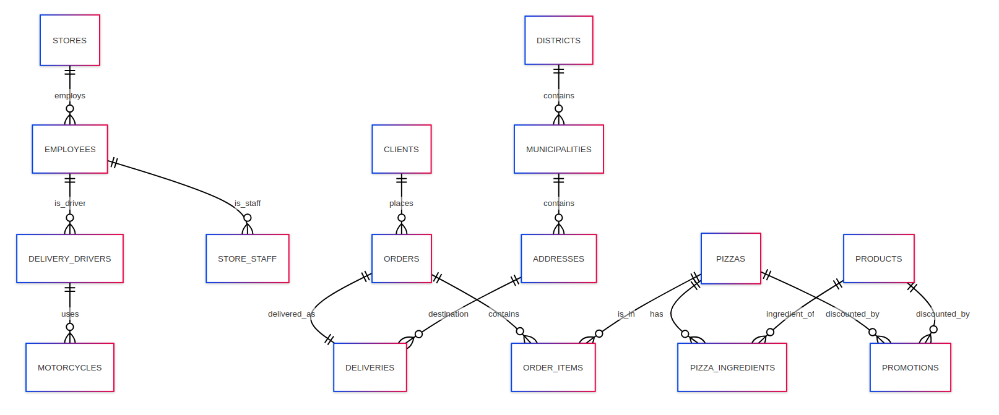

## Pizza Shop Database Schema Documentation

This document explains the design and components of the Pizza Shop database, including table purposes, relationships, triggers, views, promotions, and access control. At the end, you'll find an Entity–Relationship (ER) diagram drawn in Mermaid syntax.

---

### 1. Tables and Their Roles

1. **stores**: Contains each store's unique identifier and name. All employees and deliveries are linked back to a store.  
2. **products**: Lists all reusable items (ingredients, drinks, extras) with their base price.  
3. **pizzas**: Defines each pizza type by name and base price (before promotions).  
4. **pizza_ingredients**: A junction table linking pizzas to their component products.  
5. **clients**: Registered customers, storing contact details and unique fiscal number (NIF).  
6. **orders**: Orders placed by clients with a timestamp.  
7. **order_items**: Line items in an order, linking orders to pizzas and quantities.  
8. **districts** & **municipalities**: Geographic normalization for addresses; municipalities reference districts.  
9. **addresses**: Physical delivery locations with a foreign key to municipalities.  
10. **deliveries**: One-to-one with orders that require delivery; stores delivery timestamp and address.  
11. **takeaway_orders**: Marks orders picked up by clients rather than delivered.  
12. **employees**: All staff members, their salary, and associated store.  
13. **store_staff**: Subtype of employees working in-store (cashiers, cooks, managers) with role.  
14. **delivery_drivers**: Subtype of employees authorized to deliver (with a licence field).  
15. **motorcycles**: Vehicles assigned to delivery drivers.  
16. **promotions**: Discount rules referring to either a specific product or pizza by ID.

---

### 2. Views for Simplified Queries

- **vw_order_summary**: Summarizes each order with total amount, factoring in item prices, quantities, and active discounts.  
- **vw_pizza_composition**: Lists pizza IDs alongside arrays of their ingredient product IDs.  
- **vw_active_promotions**: Filters and shows only promotions currently valid (by calendar date).

---

### 3. Access Control (Roles & Permissions)

Four roles are defined with tailored privileges:

| Role            | Privileges                                                                                     |
|-----------------|------------------------------------------------------------------------------------------------|
| **client_role** | `SELECT` on menu tables; `INSERT` on clients, orders, order_items, takeaway_orders             |
| **staff_role**  | `SELECT`, `UPDATE` on orders, order_items, deliveries                                          |
| **driver_role** | `SELECT`, `UPDATE` on deliveries                                                               |
| **manager_role**| `ALL PRIVILEGES` on schema (for reporting, staff management, etc.)                             |

Clients see only what they need to place orders; staff and drivers handle order workflows; managers have full oversight.

---

### 6. ER Diagram 

